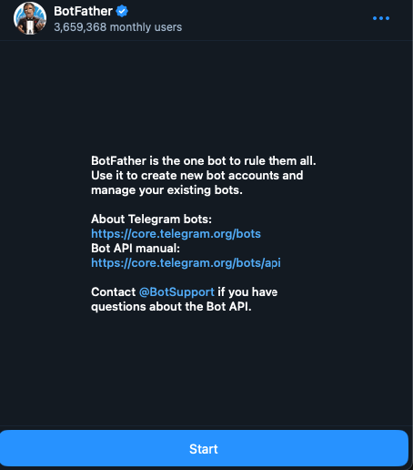
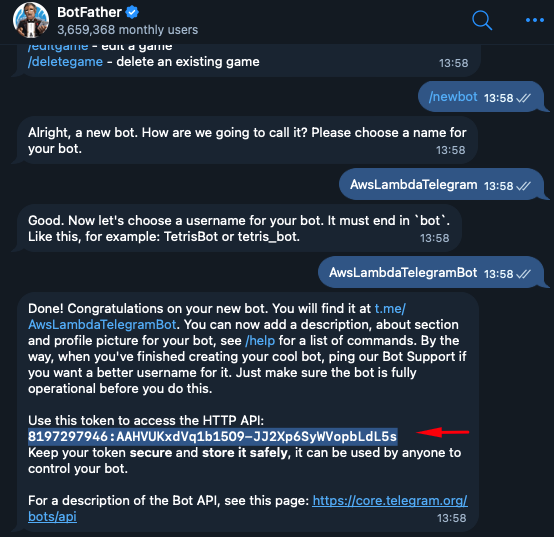
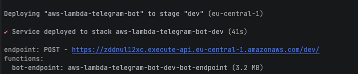

# AWS Lambda Telegram Bot – Ultra Fast, Serverless & Scalable

Build a fast, scalable, and production-grade Telegram Bot in 5 minutes using AWS Lambda, FastAPI, and the Serverless Framework — with full support for local development via uvicorn and ngrok.

- For pet projects, side projects, and production bots

# Telegram bots are great — until they grow. Then you face:

- Manual server hosting
- Complicated scaling
- Maintenance headaches

This project solves that.

✅ SnapStart dramatically reduces Lambda cold start times..

✅ Horizontal scaling is automatic by AWS Lambda.

✅ Local development is effortless with uvicorn and ngrok.

✅ From a small side-project to millions of users — this architecture just works

✅ Parsed requests are fully typed with Pydantic v2, making your code cleaner and safer, just add business logic.

⚡ Features
- Blazing-fast response time (with AWS Lambda SnapStart)
- Fully serverless: no servers to manage
- Easily deployable in under 5 minutes
- Supports local FastAPI debug with uvicorn and ngrok
- Scales horizontally by design
- Fully typed with Pydantic v2
- Plug-and-play with Telegram Webhook API


🛠️ Technical Stack
 - AWS Lambda – serverless compute
 - API Gateway – to expose FastAPI as webhook endpoint
 - FastAPI – async Python web framework
 - Mangum – ASGI adapter for AWS Lambda
 - httpx – async HTTP client to call Telegram API
 - Serverless Framework – deploy & manage the stack
 - Loguru – structured logging
 - Pydantic v2 – data parsing & validation
 - Docker - for collecting dependencies


## 📦 Requirements

| Package           | Purpose                                              |
|-------------------|------------------------------------------------------|
| `pydantic>=2.0.0` | Type-safe Telegram request parsing                   |
| `fastapi`         | Web framework for both local and Lambda              |
| `httpx`           | Asynchronous HTTP client for Telegram Bot API       |
| `mangum`          | FastAPI to Lambda adapter                            |
| `loguru`          | Logging with nice formatting and context             |
| `serverless`      | Infra deployment with AWS                            |
| `ngrok`           | Exposing local server to Telegram webhook            |

# Project Structure

```
src/
├── app/
│   └── dispatcher.py         # Business logic
├── models/
│   └── telegram_request.py   # Typed Telegram webhook model
├── infrastructure/
│   └── telegram/
│       └── telegram_api.py   # Wrapper around Telegram Bot API
├── entry_point_fastapi_app.py # FastAPI + Mangum Lambda entrypoint
├── settings.py               # ENV-based config
```

## Telegram Request Model
There is a single model[single model](src/models/telegram_request.py) for all Telegram requests, which is fully typed with Pydantic v2. It includes all possible fields that Telegram can send, so you can easily access any data in your bot logic.
```python
# part of src/models/telegram_request.py
class Message(BaseModel):
    message_id: int
    from_: User = Field(..., alias="from")
    chat: Chat
    date: int
    text: Optional[str] = None
    entities: Optional[List[MessageEntity]] = None
    media_group_id: Optional[str] = None
    photo: Optional[List[Photo]] = None
    document: Optional[Document] = None


class MyChatMember(BaseModel):
    chat: Chat
    from_: User = Field(..., alias="from")
    date: int
    old_chat_member: ChatMemberStatus
    new_chat_member: ChatMemberStatus


class TelegramRequest(BaseModel):
    update_id: int
    message: Optional[Message] = None
    my_chat_member: Optional[MyChatMember] = None

    class Config:
        populate_by_name = True
```

-------
# Usage

## 🔐 Get Your Telegram Bot Token

1. Open Telegram
2. Search for [@BotFather](https://t.me/BotFather)

3. Send the command `start` and `/newbot` and follow the instructions
4. Once your bot is created, BotFather will give you a token. It looks like:

5. Save this token to your local environment so the bot can use it.

### 🔧 Save `TELEGRAM_TOKEN` to environment for further use
```bash
export TELEGRAM_TOKEN=8197297946:AAHVUKxdVq1b15O9-JJ2Xp6SyWVopbLdL5s
```

## Check AWS credentials
https://docs.aws.amazon.com/cli/v1/userguide/cli-configure-files.html

## Clone the repository
```bash
git clone https://github.com/eslazarev/aws-lambda-telegram-bot.git
cd aws-lambda-telegram-bot
```

## Implement your bot logic
Edit the [dispatcher.py](src/app/dispatcher.py) file to implement your bot's business logic. This is where you handle incoming messages and commands.

## Install dependencies

### Install serverless globally
```bash
npm install -g serverless
```
### Install npm dependencies
```bash
npm install
```

### Install Python dependencies
```bash
pip install -r requirements-local.txt
```
### Install ngrok for local development
https://ngrok.com/downloads


## Local Development

### Start local FastAPI server
```bash
uvicorn src/entry_point_fastapi_app:app --reload
```


### Expose local server to Telegram using ngrok
```bash
ngrok http 8000
```

### Set the webhook URL in Telegram
Use the ngrok URL to set the webhook for your bot. Replace `<ngrok_url>` with the actual URL provided by ngrok.
```bash
curl -X POST "https://api.telegram.org/bot$TELEGRAM_TOKEN/setWebhook" -d "url=https://<ngrok_url>/webhook"
```

### Test your bot
Send a message to your bot in Telegram. You should see the request being logged in your terminal where you run the FastAPI server.


## Deploy to AWS Lambda

### Deploy using Serverless Framework
```bash
serverless deploy -r eu-central-1 --param=$TELEGRAM_TOKEN
```



### Set the webhook URL in Telegram
Use the API Gateway URL provided by Serverless Framework to set the webhook for your bot. Replace `<api_gateway_url>` with the actual URL.
```bash
curl -X POST "https://api.telegram.org/bot$TELEGRAM_TOKEN/setWebhook" -d "url=https://<api_gateway_url>/"
```

### Test your bot on AWS Lambda
Send a message to your bot in Telegram. You should see the request being logged in your AWS CloudWatch logs.